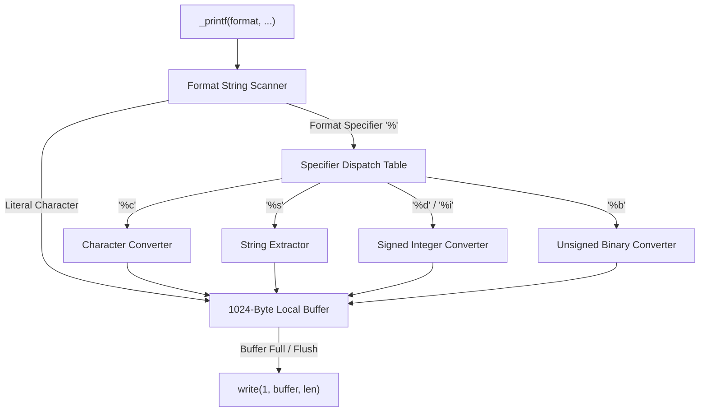

# _printf: Custom C Formatted Output Implementation

A custom, robust implementation of the standard C library `printf` function, engineered in C according to Betty coding standards, utilizing variadic argument handling and direct UNIX write system calls.



## Architecture & Implementation Details

The `_printf` function scans the input format string sequentially and processes variadic arguments via the `<stdarg.h>` macros (`va_start`, `va_arg`, `va_end`).

### Format Specifiers Supported

| Specifier | Argument Type | Output Representation |
| :---: | :--- | :--- |
| `%c` | `int` (promoted from `char`) | Single character |
| `%s` | `char *` | Null-terminated string (with `(null)` fallback) |
| `%d` | `int` | Base 10 signed integer |
| `%i` | `int` | Base 10 signed integer |
| `%b` | `unsigned int` | Custom binary representation |
| `%%` | None | Escaped literal percent sign |

### Memory and Buffer Management

To optimize performance and eliminate excessive context switching between user mode and kernel mode, formatted bytes are accumulated in a local write buffer and flushed via `write(1, ...)` upon buffer capacity or string termination.

## Compilation

Compile using `gcc` with strict compilation flags:

```bash
gcc -Wall -Werror -Wextra -pedantic -std=gnu89 *.c -o printf_test
```
